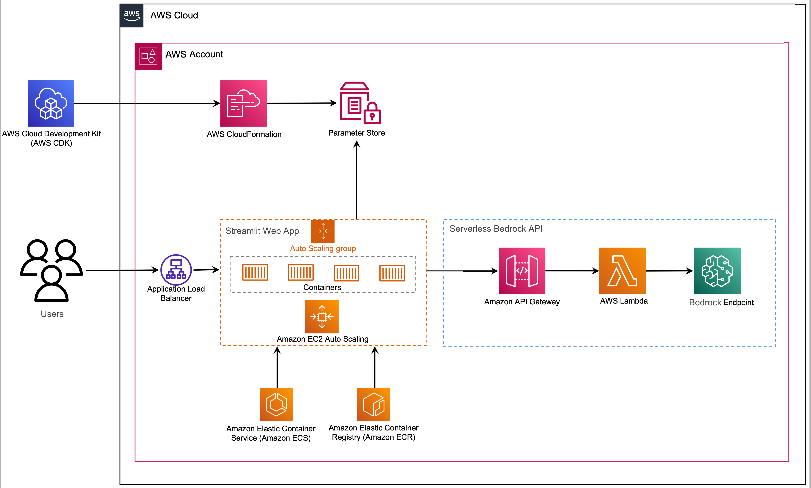

# Serverless GenAI image creator - Amazon Bedrock model deployed with AWS CDK


Generative AI is a type of AI that can create new content and ideas, including conversations, stories, images, videos, and music. Like all AI, generative AI is powered by ML models—very large models that are pre-trained on vast corpora of data and commonly referred to as foundation models (FMs).  

The size and general-purpose nature of FMs make them different from traditional ML models, which typically perform specific tasks, like analyzing text for sentiment, classifying images, and forecasting trends.

With tradition ML models, in order to achieve each specific task, you need to gather labeled data, train a model, and deploy that model. With foundation models, instead of gathering labeled data for each model and training multiple models, you can use the same pre-trained FM to adapt various tasks. You can also customize FMs to perform domain-specific functions that are differentiating to your businesses, using only a small fraction of the data and compute required to train a model from scratch. 

Generative AI has the potential to disrupt many industries by revolutionizing the way content is created and consumed. Original content production, code generation, customer service enhancement, and document summarization are typical use cases of generative AI.

Amazon Bedrock is a fully managed service that provides access to FMs from third-party providers and Amazon; available via an API. With Bedrock, you can choose from a variety of models to find the one that’s best suited for your use case.


In April 2023, AWS unveiled [Amazon Bedrock](https://aws.amazon.com/bedrock/), which provides a way to build generative AI-powered apps via pre-trained models from startups including [AI21 Labs](https://www.ai21.com/), [Anthropic](https://techcrunch.com/2023/02/27/anthropic-begins-supplying-its-text-generating-ai-models-to-startups/), and [Stability AI](https://techcrunch.com/2022/10/17/stability-ai-the-startup-behind-stable-diffusion-raises-101m/). Amazon Bedrock also offers access to Titan foundation models, a family of models trained in-house by AWS. With the serverless experience of Amazon Bedrock, you can easily find the right model for your needs, get started quickly, privately customize FMs with your own data, and easily integrate and deploy them into your applications using the AWS tools and capabilities you’re familiar with (including integrations with SageMaker ML features like [Amazon SageMaker Experiments](https://docs.aws.amazon.com/sagemaker/latest/dg/experiments.html) to test different models and [Amazon SageMaker Pipelines](https://aws.amazon.com/sagemaker/pipelines/) to manage your FMs at scale) without having to manage any infrastructure.
 

In this post, we show how to invoke the amazon.titan-image-generator-v1 image generation model using using a Streamlit UI deployed using Serverless services with [AWS Cloud Development Kit](https://aws.amazon.com/cdk/) (AWS CDK). The AWS CDK is an open-source software development framework to define your cloud application resources using familiar programming languages like Python.


## Solution overview

The web application is built on [Streamlit](https://streamlit.io/), an open-source Python library that makes it easy to create and share beautiful, custom web apps for ML and data science. We host the web application using [Amazon Elastic Container Service](https://aws.amazon.com/ecs) (Amazon ECS) with [AWS Fargate](https://docs.aws.amazon.com/AmazonECS/latest/userguide/what-is-fargate.html) and it is accessed via an Application Load Balancer. Fargate is a technology that you can use with Amazon ECS to run [containers](https://aws.amazon.com/what-are-containers) without having to manage servers or clusters or virtual machines. The Bedrock model endpoint is invoked from the [AWS Lambda](http://aws.amazon.com/lambda) function. The web application interacts with the models via [Amazon API Gateway](https://aws.amazon.com/api-gateway) and [AWS Lambda](http://aws.amazon.com/lambda) functions as shown in the following diagram.



API Gateway provides the web application and other clients a standard RESTful interface, while shielding the Lambda function that interfaces with the model. This simplifies the client application code that consumes the models. The API Gateway endpoints are publicly accessible in this example, allowing for the possibility to extend this architecture to implement different [API access controls](https://docs.aws.amazon.com/apigateway/latest/developerguide/apigateway-control-access-to-api.html) and integrate with other applications.

 
In this post, we walk you through the following steps:

1. Install the [AWS Command Line Interface](http://aws.amazon.com/cli) (AWS CLI) and [AWS CDK v2](https://docs.aws.amazon.com/cdk/v2/guide/getting_started.html) on your local machine.
2. Clone and set up the AWS CDK application.
3. Deploy the AWS CDK application.
4. Invoke the image generation Bedrock model.
5. View the deployed resources on the [AWS Management Console](http://aws.amazon.com/console).


## Prerequisites

You must have the following prerequisites:

- An [AWS account](https://signin.aws.amazon.com/signin)
- The [AWS CLI v2](https://docs.aws.amazon.com/cli/latest/userguide/install-cliv2.html)
- Python 3.6 or later
- node.js 14.x or later
- The [AWS CDK v2](https://docs.aws.amazon.com/cdk/v2/guide/getting_started.html)
- Docker v20.10 or later

 You can deploy the infrastructure in this tutorial from your local computer or you can use [AWS Cloud9](https://aws.amazon.com/cloud9/) as your deployment workstation. AWS Cloud9 comes pre-loaded with AWS CLI, AWS CDK and Docker. If you opt for AWS Cloud9, [create the environment](https://docs.aws.amazon.com/cloud9/latest/user-guide/tutorial-create-environment.html) from the [AWS console](https://console.aws.amazon.com/cloud9).

Make sure you delete the resources you create in this post to avoid ongoing charges.


## Install the AWS CLI and AWS CDK on your local machine

If you don’t already have the AWS CLI on your local machine, refer to [Installing or updating the latest version of the AWS CLI](https://docs.aws.amazon.com/cli/latest/userguide/getting-started-install.html) and [Configuring the AWS CLI](https://docs.aws.amazon.com/cli/latest/userguide/cli-chap-configure.html).

Install the AWS CDK Toolkit globally using the following node package manager command:

```
npm install -g aws-cdk-lib@latest
```

Run the following command to verify the correct installation and print the version number of the AWS CDK:

```
cdk --version
```

Make sure you have Docker installed on your local machine. Issue the following command to verify the version:

```
docker --version
```


## Clone and set up the AWS CDK application

On your local machine, clone the AWS CDK application with the following command:

```
git clone https://github.com/suryakva/genai-titan-image-generator.git
```

Navigate to the project folder:

```
cd genai-titan-image-generator
```


The `stack` folder contains the code for each stack in the AWS CDK application. The `code` folder contains the code for the Amazon Lambda function. The repository also contains the web application located  under the folder `web-app`. 

The `cdk.json` file tells the AWS CDK Toolkit how to run your application.

This application was tested in the `us-east-1` Region but it should work in any Region that has the required services. 


#### Setup a virtual environment

This project is set up like a standard Python project. Create a Python virtual environment using the following code:

```
python3 -m venv .venv
```

Use the following command to activate the virtual environment:

```
source .venv/bin/activate
```

If you’re on a Windows platform, activate the virtual environment as follows:

```
.venv\Scripts\activate.bat
```

After the virtual environment is activated, upgrade pip to the latest version:

```
python3 -m pip install --upgrade pip
```

Install the required dependencies:

```
pip install -r requirements.txt
```

Before you deploy any AWS CDK application, you need to bootstrap a space in your account and the Region you’re deploying into. To bootstrap in your default Region, issue the following command:

```
cdk bootstrap
```

If you want to deploy into a specific account and Region, issue the following command:

```
cdk bootstrap aws://ACCOUNT-NUMBER/REGION
```

For more information about this setup, visit  [Getting started with the AWS CDK](https://docs.aws.amazon.com/cdk/latest/guide/getting_started.html).


#### AWS CDK application stack structure

You can list stacks in your CDK application with the following command:

```bash
cdk list
```
You should get the following output:

```
VpcNetworkStack
ApplicationStack
```


Other useful AWS CDK commands:

 * `cdk ls`     - Lists all stacks in the app
 * `cdk synth`    - Emits the synthesized AWS CloudFormation template
 * `cdk deploy`    - Deploys this stack to your default AWS account and Region
 * `cdk diff`     - Compares the deployed stack with current state
 * `cdk docs`     - Opens the AWS CDK documentation

The next section shows you how to deploy the AWS CDK application.


## Deploy the AWS CDK application

The AWS CDK application will be deployed to the default Region based on your workstation configuration. If you want to force the deployment in a specific Region, set your `AWS_DEFAULT_REGION` environment variable accordingly.


At this point, you can deploy the AWS CDK application. First you launch the VPC network stack:

```
cdk deploy VpcNetworkStack
```

If you are prompted, enter `y` to proceed with the deployment. You should see a list of AWS resources that are being provisioned in the stack. This step takes around 3 minutes to complete.


Then you  launch the web application stack:

```
cdk deploy ApplicationStack
```

After analyzing the stack, the AWS CDK will display the resource list in the stack. Enter y to proceed with the deployment. This step takes around 5 minutes.


Note down the `WebApplicationServiceURL` from the output as you will use it later. You can also retrieve it later in the CloudFormation console, under the `ApplicationStack` stack outputs.


## Invoke the image generation Bedrock model

1. Access the web application using the `WebApplicationServiceURL` from the output of the `ApplicationStack` in your browser.

2. Enter a prompt in the prompt text field Ex: "Waterfall on Mars" 

3. Click the **Generate** button.

The application will make a call to the Bedrock endpoint. It takes a few seconds. An image with the details in your text prompt description will be displayed.


## Clean up

To avoid unnecessary cost, clean up all the infrastructure created with the following command on your workstation:

```
cdk destroy --all
```

Enter `y` at the prompt. This step takes around 10 minutes. Check if all resources are deleted on the console. Also delete the assets S3 buckets created by the AWS CDK on the Amazon S3 console as well as the assets repositories on Amazon ECR.


## Conclusion

As demonstrated in this post, you can use the AWS CDK to deploy Serverless architectures to invoke Bedrock models. We showed an image generation example using a user interface powered by Streamlit, Lambda, and API Gateway.


## License summary

This sample code is made available under a modified MIT license. See the [LICENSE](https://github.com/suryakva/genai-titan-image-generator/blob/main/LICENSE) file for more information.


